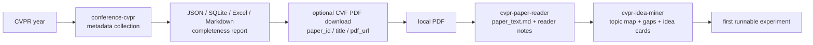

# CVPR-skills

<p align="center">
  <strong>中文 | English</strong><br>
  <a href="#中文说明">中文说明</a> · <a href="#english-overview">English overview</a>
</p>

<p align="center">
  <a href="https://github.com/Daniel123jia/CVPR-skills/actions/workflows/test.yml"></a>
  
  
  
  
</p>

面向 CVPR 论文采集、全文精读与研究 idea 挖掘的 Agent Skill 工具箱。

CVPR-skills is an Agent Skill repository for CVPR paper collection, optional CVF PDF download, fulltext reading, and research idea mining.

> 从 CVPR metadata 到论文精读、研究 gap、idea cards 和第一周可跑实验：先证据，后结论。

## 中文说明

CVPR-skills 是一个围绕 CVPR 论文的 Agent Skill 仓库，覆盖从 CVF Open Access 元数据采集、可选 PDF 下载、全文阅读、实验整理，到研究 idea 挖掘和复现计划生成的完整工作流。

它面向 Codex / Claude Code / Agent 工作流，不是普通爬虫，也不是通用论文数据库。项目核心目标是让用户从“论文列表”一步步走到“有证据边界的阅读笔记、研究 gap、idea cards 和第一周可跑实验”，同时避免 hallucination 和 evidence 越界。

一个面向 CVPR main conference papers 的 Codex / Claude Code Agent Skill repository。当前仓库只做 CVPR-skills，只支持 CVPR main conference papers。当前包含三个 skills：`conference-cvpr`、`cvpr-paper-reader`、`cvpr-idea-miner`。

版本策略：README badge 中的 GitHub Release version 表示项目发布版本，例如 `v1.5` / `v1.5.1`；各 `manifest.yaml version` 是 skill-level internal/schema version，可以不强行等同 GitHub release version。

<a id="english-overview"></a>
<details>
<summary><strong>English Overview</strong></summary>

CVPR-skills is a Codex / Claude Code Agent Skill repository for CVPR main conference papers. It connects CVF Open Access metadata collection, optional explicit PDF download, local fulltext reading, evidence-aware notes, gap analysis, idea cards, and first runnable experiment planning.

It is designed for explicit research workflows: every claim should be tied to metadata, PDF text, reader notes, or a clearly labeled agent hypothesis.

Version policy: the GitHub Release version is the project release version, while each `manifest.yaml version` is a skill-level internal/schema version and does not need to match the release badge.

</details>



## CVPR-skills 是什么？ / What Is CVPR-skills?

CVPR-skills 帮助用户从 CVPR metadata 一步步走到结构化阅读笔记、研究 gap、idea cards 和第一周可跑实验：

```text
CVPR metadata -> paper PDF -> structured reading notes -> research gaps -> idea cards -> first runnable experiment
```

```text
CVPR year -> metadata collection -> paper_id / title / pdf_url -> optional explicit CVF PDF download -> local PDF -> paper_text.md -> reader files -> reader_notes_index.json -> idea cards / experiment plan
```

它不是普通爬虫，不是通用论文数据库，也不是静默下载整届会议 PDF 的工具。它是面向 Codex / Claude Code / Agent workflow 的 CVPR paper skills repository，核心目标是 evidence-aware paper workflow。

仓库强调每一步都显式、可检查：

- 从 CVF Open Access 采集 CVPR main conference metadata。
- 只有当用户通过 `paper_id`、`title` 或 `pdf_url` 明确选择单篇论文时，才执行 optional CVF PDF download。
- 从本地 PDF 或用户提供的 PDF 提取 `paper_text.md` 后再做全文阅读。
- 生成受证据约束的 reading notes、topic maps、research gaps、idea cards 和 experiment plans。

> 不会自动下载整届会议 PDF。No automatic full-conference PDF download. Also: no automatic full-conference PDF download.

中文理解：它不是“一键生成论文结论”的工具，而是一套 evidence-first 的论文工作流。能看到什么证据，就写什么结论；没有证据，就明确写成 `evidence gap`。

## 它能做什么？ / What Can It Do?

### 中文快速导航

| 你从哪里开始 | 推荐 skill | 会生成什么 | 特别注意 |
| --- | --- | --- | --- |
| 从 CVPR 年份开始 | `conference-cvpr` | CVPR metadata、JSON / SQLite / Excel / Markdown、完整性报告 | 默认只采集 metadata，不下载整届 PDF |
| 从 paper_id / 标题 / pdf_url 开始 | `conference-cvpr` + optional downloader | 匹配到的 metadata、dry-run 下载计划、可选单篇 CVF PDF | 只允许 `openaccess.thecvf.com`，先 `--dry-run` |
| 从本地 PDF 开始 | `cvpr-paper-reader` | `paper_text.md`、阅读笔记、方法、实验、局限性、可选复现清单 | 不做 OCR，不编造缺失的代码、超参或补充材料 |
| 从 reader notes 开始 | `cvpr-idea-miner` | `topic_map.md`、`gap_analysis.md`、`idea_cards.md`、`experiment_plan.md` | 单篇论文只能写 local topic map，不能写成 CVPR trend |

| 输入 | 使用 skill | 证据等级 | 输出 | 适合场景 |
| --- | --- | --- | --- | --- |
| CVPR year | `conference-cvpr` | metadata | JSON / SQLite / Excel / Markdown / completeness report | 构建 CVPR paper index |
| `paper_id` / `title` | `conference-cvpr` + optional downloader | metadata / `pdf_url` | matched metadata / dry-run download plan / optional PDF | 定位单篇论文并准备全文阅读 |
| CVF `pdf_url` | `conference-cvpr` + optional downloader | explicit URL | dry-run validation / optional PDF / `.pdf.json` sidecar / SHA-256 | 从已知 CVF Open Access PDF URL 开始 |
| local PDF | `cvpr-paper-reader` | fulltext | `paper_text.md` / `reading_note.md` / `method.md` / `experiments.md` / `limitations_and_ideas.md` / optional `reproduction_checklist.md` | 精读并理解单篇论文 |
| reader notes | `cvpr-idea-miner` | `reader_notes` / `fulltext_notes` | `topic_map.md` / `gap_analysis.md` / `idea_cards.md` / `experiment_plan.md` | 从阅读笔记中寻找研究 idea 和实验计划 |

## 三个 skills 概览 / Three Skills Overview

| Skill | Level | Purpose | Main outputs |
| --- | --- | --- | --- |
| `conference-cvpr` | conference-level | collect/export/check CVPR metadata and optionally download explicit CVF PDFs | JSON, SQLite, Excel, Markdown, completeness report, optional PDF |
| `cvpr-paper-reader` | paper-level | read local/fulltext CVPR papers with evidence boundaries | `paper_text.md`, `reading_note.md`, `method.md`, `experiments.md`, `limitations_and_ideas.md`, `reproduction_checklist.md` |
| `cvpr-idea-miner` | note/idea-level | mine gaps, idea cards, and experiment plans from reader notes | `reader_notes_index.json`, `topic_map.md`, `gap_analysis.md`, `idea_cards.md`, `experiment_plan.md` |

## Skill 导航 / Skill Navigator

| Skill | 角色 | 做什么 | 不做什么 |
| --- | --- | --- | --- |
| `conference-cvpr` | CVPR main conference metadata workflow | 从 CVF Open Access 采集 metadata，清洗记录，导出 artifacts，检查完整性，并支持 v1.5 optional explicit PDF download | 不负责精读论文，不下载代码仓库，也不会默认批量下载整届 PDF |
| `cvpr-paper-reader` | 单篇或小批量论文阅读 workflow | 提取本地 PDF 文本，应用 evidence levels，生成 reader artifacts，加入 `Numeric Extraction Confidence`，可生成 `reproduction_checklist.md` | 不编造缺失的代码链接、补充材料、数据集、超参或实验结果 |
| `cvpr-idea-miner` | 多篇论文/阅读笔记的研究灵感挖掘 workflow | 通过 `--selected-root` 收集 reader notes，按证据过滤，标题去重，并生成 local topic map、gap analysis、idea cards、experiment plans | 不把单篇论文写成 CVPR trend，不把 hypothesis 写成 paper fact |

常见 agent 路线 / Common agent routes:

| 场景 | 用户意图 | Agent 路线 | 推荐入口 |
| --- | --- | --- | --- |
| 一键完整流程 | "Get CVPR 2026 papers and export results" | 采集 → 清洗 → 导出 → 检查 | `python skills/conference-cvpr/scripts/run_pipeline.py --year 2026` |
| 小样本试跑 | "Run a small CVPR sample" | collect -> normalize -> export -> check | `python skills/conference-cvpr/scripts/run_pipeline.py --year 2026 --limit 5` |
| 按 paper_id 下载单篇 PDF | "Download paper_id CVPR2026_000002" | metadata match -> optional PDF download | `download_cvf_pdf.py ... --paper-id CVPR2026_000002 --dry-run` |
| 按标题准备单篇 PDF | "Find and prepare this paper by title" | title match -> dry run -> optional PDF | `download_cvf_pdf.py ... --title "..." --dry-run` |
| 单篇论文精读 | "Read this CVPR paper" | extract text -> reader notes | `skills/cvpr-paper-reader/` |
| 多篇笔记找 idea | "从这些 CVPR 论文找研究灵感" | topic-map -> gap-analysis -> idea-cards -> experiment-plan | `skills/cvpr-idea-miner/` |

只支持 CVPR main conference papers. It does not collect workshops, add other conference skills, call external enrichment APIs, run GitHub Search, or download code repositories. The recommended fulltext route is:

```text
metadata match -> optional PDF download -> extract text -> paper-reader -> idea-miner
```

## 端到端工作流 / End-to-End Workflows

### Workflow A：从 CVPR 年份到 metadata / From CVPR year to metadata

```bash
python skills/conference-cvpr/scripts/run_pipeline.py --year 2026 --limit 5
```

典型本地输出路径：

```text
data/normalized/computer_vision/cvpr/2026/cvpr_2026_normalized.json
outputs/computer_vision/cvpr/2026/cvpr_2026_papers.json
outputs/computer_vision/cvpr/2026/
```

推荐把 `outputs/computer_vision/cvpr/2026/cvpr_2026_papers.json` 作为 optional PDF downloader 的 metadata 输入。

高级用法: run each conference step separately.

```bash
python skills/conference-cvpr/scripts/collect_cvpr.py --year 2026
python skills/conference-cvpr/scripts/normalize_cvpr.py --year 2026
python skills/conference-cvpr/scripts/export_cvpr.py --year 2026
python skills/conference-cvpr/scripts/check_completeness.py --year 2026
```

### Workflow B：从 `paper_id` / `title` / `pdf_url` 到可选 CVF PDF 下载 / From paper identity to optional CVF PDF download

下载器是 optional、explicit、dry-run first。它只接受来自 `openaccess.thecvf.com` 的 CVF Open Access PDF URL；不会默认下载整届会议 PDF，也不会下载代码仓库。

按 `paper_id`：

```bash
python skills/conference-cvpr/scripts/download_cvf_pdf.py \
  --metadata outputs/computer_vision/cvpr/2026/cvpr_2026_papers.json \
  --paper-id CVPR2026_000002 \
  --output-dir outputs/computer_vision/cvpr/pdfs/2026 \
  --dry-run
```

按 title：

```bash
python skills/conference-cvpr/scripts/download_cvf_pdf.py \
  --metadata outputs/computer_vision/cvpr/2026/cvpr_2026_papers.json \
  --title "DirectFisheye-GS: Enabling Native Fisheye Input in Gaussian Splatting with Cross-View Joint Optimization" \
  --output-dir outputs/computer_vision/cvpr/pdfs/2026 \
  --dry-run
```

按直接 CVF `pdf_url`：

```bash
python skills/conference-cvpr/scripts/download_cvf_pdf.py \
  --pdf-url https://openaccess.thecvf.com/content/CVPR2026/papers/example.pdf \
  --paper-id CVPR2026_000002 \
  --output-dir outputs/computer_vision/cvpr/pdfs/2026 \
  --dry-run
```

只有检查完 URL 和输出路径后才移除 `--dry-run`。实际 PDF、sidecar JSON、checksum 和日志都属于 runtime artifacts。

### Workflow C：从本地 PDF 到全文阅读和 idea / From local PDF to fulltext reading and ideas

从用户已有的本地 PDF 开始，或从 optional CVF PDF download workflow 显式选择的一篇 PDF 开始。

```bash
python skills/cvpr-paper-reader/scripts/extract_pdf_text.py \
  --pdf /path/to/local_cvpr_paper.pdf \
  --output outputs/computer_vision/cvpr/reader/example_paper/paper_text.md
```

然后使用 `cvpr-paper-reader` 生成：

```text
outputs/computer_vision/cvpr/reader/example_paper/reading_note.md
outputs/computer_vision/cvpr/reader/example_paper/method.md
outputs/computer_vision/cvpr/reader/example_paper/experiments.md
outputs/computer_vision/cvpr/reader/example_paper/limitations_and_ideas.md
outputs/computer_vision/cvpr/reader/example_paper/reproduction_checklist.md
```

进入 idea mining 前，先索引选中的 reader notes：

```bash
python skills/cvpr-idea-miner/scripts/collect_reader_notes.py \
  --selected-root outputs/computer_vision/cvpr/reader/{paper_id} \
  --min-evidence-level fulltext \
  --dedupe-title prefer_highest_evidence \
  --output outputs/computer_vision/cvpr/ideas/{paper_id}/reader_notes_index.json
```

如果要扫描整个 reader root：

```bash
python skills/cvpr-idea-miner/scripts/collect_reader_notes.py \
  --input-dir outputs/computer_vision/cvpr/reader \
  --output outputs/computer_vision/cvpr/ideas/reader_notes_index.json
```

然后使用 `cvpr-idea-miner` 生成：

```text
outputs/computer_vision/cvpr/ideas/{paper_id}/topic_map.md
outputs/computer_vision/cvpr/ideas/{paper_id}/gap_analysis.md
outputs/computer_vision/cvpr/ideas/{paper_id}/idea_cards.md
outputs/computer_vision/cvpr/ideas/{paper_id}/experiment_plan.md
```

## 证据等级 / Evidence Levels

证据等级决定 agent 可以写什么、不能写什么。

| 证据等级 | 可以写什么 | 不能越界 |
| --- | --- | --- |
| `title_only` | 粗粒度主题判断和 preliminary routing | 不能写方法细节、实验结果、数据集、ablation 或实现细节 |
| `abstract_only` | 基于标题和摘要的 preliminary summary | 不能补实验细节、baseline、数值结果或代码信息 |
| `fulltext` | 从 `paper_text.md` 中提取方法、实验、局限性和复现要点 | 仍受 `paper_text.md` 约束；缺失内容必须写成 evidence gap |
| `reader_notes` | 基于 reader artifacts 做 gap analysis 和 idea cards | 必须继承 reader notes 的证据边界 |
| `fulltext_notes` | 基于全文阅读产物做较完整的方法组合和实验计划 | 不能把 hypothesis 写成 paper fact |
| `user_hypothesis` | 明确标记的用户设想或 agent hypothesis | 必须与论文证据分开 |

如果证据缺失，就写 `evidence gap`。Ideas 必须标记为 `agent hypothesis`。单篇论文的 topic map 是 local analysis，不是 CVPR trend。

中文规则：`title_only` 不能写方法细节和实验结果；`abstract_only` 只能做 preliminary summary；`fulltext` 可以整理方法和实验，但仍必须受 `paper_text.md` 约束；idea 必须标记为 `agent hypothesis`。

## 质量护栏 / Quality Guards

- 不编造 code links。
- 不编造 citation counts。
- 不编造 leaderboard。
- 不编造未出现的数据集、baseline、ablation 或实验结果。
- 当 PDF 表格文本压缩或含混时，必须使用 `Numeric Extraction Confidence`。
- `--selected-root` 支持 selected-root-only note collection，用于单篇论文或单个本地验收案例。
- `--dedupe-title prefer_highest_evidence` 让高证据等级 notes 覆盖 title-only 或 abstract-only duplicates。
- `reproduction_checklist.md` 是 feasibility 和 experiment planning 的 optional evidence source。
- `reproduction_checklist.md` is an optional reader artifact。
- 单篇论文 topic map 必须标记为 `single-paper` / `local topic map`，不能写成 CVPR trends。
- 缺失代码、补充材料、超参或数据集时，必须记录为 evidence gaps。

## 已验证案例 / Validated Cases

这些案例作为本地 ignored outputs 完成验证，不提交到仓库。

| 案例 | 输入 | 证据等级 | 阅读产物 | idea 产物 | 结论 |
| --- | --- | --- | --- | --- | --- |
| DirectFisheye-GS | local CVPR 2026 PDF | fulltext | 4 reader files | 4 idea files | pass |
| SAM3DBody | local CVPR PDF | fulltext | 4 reader files + reproduction checklist | 4 idea files | pass |

这两个案例的 manual validation reports 未发现 hallucination、evidence-boundary violation、强行从表格得出结论、或把单篇分析夸大成趋势。注意：这只说明这些案例已验证，不等于保证未来所有运行都完全无幻觉。

其他已验证状态：

- DirectFisheye-GS fulltext loop: pass.
- SAM3DBody fulltext loop: pass.
- v1.4.4 selected-root-only workflow: verified.
- v1.5 optional CVF PDF download workflow: dry-run, safe URL restriction, sidecar JSON, and SHA-256 support.
- 91 tests OK on Python 3.11 before this v1.5.1 README contract; this polish adds a README documentation contract test.
- GitHub Actions enabled.

## 安装 / Installation

推荐 Python: 3.10 或 3.11。CI 使用 Python 3.11 验证。

```bash
git clone https://github.com/Daniel123jia/CVPR-skills.git
cd CVPR-skills
python3.11 -m venv .venv
source .venv/bin/activate
pip install -r requirements.txt
```

`pypdf` 固定在稳定兼容范围：

```text
pypdf>=3.17.4,<4.0
```

`data/`、`outputs/`、`logs/`、PDF、Excel、SQLite 和其他生成文件都是 ignored runtime outputs。

## 仓库结构 / Repository Layout

```text
CVPR-skills/
├── skills/
│   ├── conference-cvpr/
│   │   └── scripts/
│   │       ├── run_pipeline.py
│   │       └── download_cvf_pdf.py
│   ├── cvpr-paper-reader/
│   │   └── scripts/
│   │       └── extract_pdf_text.py
│   └── cvpr-idea-miner/
│       └── scripts/
│           └── collect_reader_notes.py
├── examples/
├── evals/
├── tests/
├── README.md
└── requirements.txt
```

`skills/_shared/` 存放共享 schema、templates 和 policies，不是独立 skill。

## 项目边界 / Scope and Non-goals

当前范围：

- CVPR main conference papers.
- CVF Open Access metadata.
- Optional explicit CVF PDF download.
- Local/user-provided PDF fulltext.
- Evidence-aware reading and idea mining.

Non-goals / 不做的事：

- No automatic full-conference PDF download.
- No workshop collection by default.
- No OCR.
- No code repository download.
- No OpenAlex / Semantic Scholar / DBLP / Papers With Code enrichment.
- No GitHub Search.
- No claim beyond provided evidence.
- No submission-ready paper writing without human review.

中文边界：当前项目只聚焦 CVPR main conference papers，不默认采集 workshop，不自动下载整届 PDF，不做 OCR，不接 OpenAlex / Semantic Scholar / DBLP / Papers With Code，不把没有证据的内容写成论文事实。

## 运行产物 / Runtime artifacts

不要提交生成或下载的运行产物：

```text
data/
outputs/
logs/
*.pdf
*.pdf.json
*.sqlite
*.db
*.xlsx
paper_text.md
```

`outputs/` 可能包含真实本地验收结果、PDF、reader notes、idea cards、Excel exports 和 SQLite databases。它们是 runtime artifacts，不是源码。

## 干净克隆演示 / Clean clone walkthrough

最小 clone-to-first-run 路径见 `examples/clean_clone_walkthrough.md`。它覆盖 clone、virtualenv、依赖安装、测试、CVPR 2026 `--limit 5` sample run，以及进入 `cvpr-paper-reader` 和 `cvpr-idea-miner` 的衔接。

## 本地验证 / Clean clone validation

干净克隆后，只运行本地检查：

```bash
python -m unittest discover -s tests
python skills/conference-cvpr/scripts/run_pipeline.py --help
python skills/conference-cvpr/scripts/download_cvf_pdf.py --help
python skills/cvpr-paper-reader/scripts/extract_pdf_text.py --help
python skills/cvpr-idea-miner/scripts/collect_reader_notes.py --help
git diff --check
```

这些检查不会执行真实 CVF collection，不调用外部 enrichment API，不下载 PDF，不解析真实 PDF，也不会创建需要提交的 runtime artifacts。

## 全文本地验收 / Fulltext local validation

Fulltext validation 只在本地进行。使用已有的 CVPR PDF，或显式下载一篇选中的 CVF PDF 到 ignored output directory，然后参考：

```text
examples/end_to_end_demo/fulltext_case_guide.md
```

该 guide 覆盖 `paper_text.md` extraction、fulltext reader notes、idea-card generation，以及 evidence level、evidence source、risk、first runnable experiment 和 anti-hallucination rules 的人工检查。

## 真实全文案例 / Real fulltext validation

当有真实本地 PDF 时，用 `examples/end_to_end_demo/fulltext_validation_report_template.md` 记录 manual acceptance result。模板会检查 source paths、generated reader and idea files、hallucination risks、evidence-backed method/experiment notes、agent hypotheses 和 final verdict。

## CI 与测试 / CI status / testing

GitHub Actions 在 `push` 和 `pull_request` 时使用 Python 3.11 运行本地验证：

```text
.github/workflows/test.yml
```

CI 会安装 `requirements.txt`，运行 `python -m unittest discover -s tests`，并用 `--help` 检查 helper CLIs。Downloader tests 使用 mocks；测试中不会发生真实网络下载。

当前验证命令：

```bash
python -m unittest discover -s tests
python skills/conference-cvpr/scripts/run_pipeline.py --help
python skills/conference-cvpr/scripts/download_cvf_pdf.py --help
python skills/cvpr-paper-reader/scripts/extract_pdf_text.py --help
python skills/cvpr-idea-miner/scripts/collect_reader_notes.py --help
git diff --check
```

当前文档基线：Python 3.11 下 91 tests OK。v1.5.1 README polish 之后增加了 focused README contract tests。

## 轻量评测 / Evals

`evals/` 包含轻量 routing 与 guardrail examples，包括：

- `collect_cvpr_2026`
- `export_cvpr_excel`
- `analyze_low_abstract_coverage`
- `reject_non_cvpr`
- `read_single_cvpr_paper`
- `method_extraction`
- `abstract_only_warning`
- `idea_from_reader_notes`
- `title_only_idea_warning`
- `method_recombination`
- `title_only_no_method_details`
- `abstract_only_no_experiment_claims`
- `fulltext_no_hallucination`
- `optional_pdf_download_workflow`
- `reader_notes_filtering_and_dedupe`
- `numeric_extraction_confidence`
- `single_paper_topic_map_boundary`
- `idea_feasibility_fields`
- `reproduction_checklist_integration`

它们用于检查 agent 是否选择正确 workflow，并保持在 evidence boundaries 内。

## 设计理念 / Design Philosophy

证据优先。动作显式。不静默下载。不编造结论。运行产物不进 Git。Ideas 是 hypotheses，不是 paper facts。

中文概括：证据优先，动作显式，不静默下载，不编造结论，运行产物不进 Git，idea 永远是 hypothesis 而不是论文事实。
