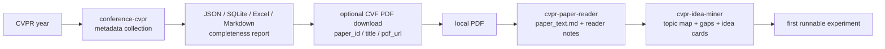

# CVPR-skills

[](https://github.com/Daniel123jia/CVPR-skills/actions/workflows/test.yml)

Agent Skills for CVPR paper collection, fulltext reading, and research idea mining.

CVPR-skills 是一个围绕 CVPR 论文的 Agent Skill 仓库，覆盖从 CVF Open Access 元数据采集、可选 PDF 下载、全文阅读、实验整理，到研究 idea 挖掘和复现计划生成的完整工作流。

一个面向 CVPR main conference papers 的 Codex / Claude Code Agent Skill repository。当前仓库只做 CVPR-skills，当前包含三个 skills：`conference-cvpr`、`cvpr-paper-reader`、`cvpr-idea-miner`。



## What Is CVPR-skills?

CVPR-skills helps users move from:

```text
CVPR metadata -> paper PDF -> structured reading notes -> research gaps -> idea cards -> first runnable experiment
```

It is not a general crawler, not a universal paper database, and not a tool for silently downloading every PDF from a conference. It is a CVPR paper skills repository for Codex / Claude Code / Agent workflows, with an evidence-aware paper workflow as the core design goal.

The repository focuses on explicit, inspectable transitions:

- CVF Open Access metadata collection for CVPR main conference papers.
- Optional CVF PDF download only when the user selects one paper by `paper_id`, `title`, or `pdf_url`.
- Local/user-provided PDF reading through extracted `paper_text.md`.
- Evidence-bounded notes, topic maps, research gaps, idea cards, and experiment plans.

> No automatic full-conference PDF download. Also: no automatic full-conference PDF download.

## What Can It Do?

| Input | Skill used | Evidence level | Outputs | Best for |
| --- | --- | --- | --- | --- |
| CVPR year | `conference-cvpr` | metadata | JSON / SQLite / Excel / Markdown / completeness report | Building a CVPR paper index |
| `paper_id` / `title` | `conference-cvpr` + optional downloader | metadata / `pdf_url` | Matched metadata / dry-run download plan / optional PDF | Locating one paper and preparing fulltext reading |
| CVF `pdf_url` | `conference-cvpr` + optional downloader | explicit URL | Dry-run validation / optional PDF / `.pdf.json` sidecar / SHA-256 | Starting from a known CVF Open Access PDF URL |
| local PDF | `cvpr-paper-reader` | fulltext | `paper_text.md` / `reading_note.md` / `method.md` / `experiments.md` / `limitations_and_ideas.md` / optional `reproduction_checklist.md` | Reading and understanding one paper |
| reader notes | `cvpr-idea-miner` | `reader_notes` / `fulltext_notes` | `topic_map.md` / `gap_analysis.md` / `idea_cards.md` / `experiment_plan.md` | Finding research ideas and experiment plans |

## Skill Navigator

| Skill | Role | What it does | Does not do |
| --- | --- | --- | --- |
| `conference-cvpr` | CVPR main conference metadata workflow | Collects from CVF Open Access, normalizes records, exports artifacts, checks completeness, and supports optional explicit PDF download in v1.5 | Does not read papers, download code repositories, or batch-download all PDFs by default |
| `cvpr-paper-reader` | Single-paper or small-batch reading workflow | Extracts local PDF text, applies evidence levels, creates reader artifacts, adds `Numeric Extraction Confidence`, and can produce `reproduction_checklist.md` | Does not invent missing code links, supplement details, datasets, hyperparameters, or results |
| `cvpr-idea-miner` | Multi-note idea mining workflow | Collects reader notes with `--selected-root`, filters by evidence, deduplicates titles, and supports 多篇论文/阅读笔记的研究灵感挖掘 through local topic maps, gap analysis, idea cards, and experiment plans | Does not treat one paper as a CVPR trend or convert hypotheses into paper facts |

Common agent routes:

| Scenario | User intent | Agent route | Recommended entry |
| --- | --- | --- | --- |
| 一键完整流程 | "Get CVPR 2026 papers and export results" | 采集 → 清洗 → 导出 → 检查 | `python skills/conference-cvpr/scripts/run_pipeline.py --year 2026` |
| Quick sample | "Run a small CVPR sample" | collect -> normalize -> export -> check | `python skills/conference-cvpr/scripts/run_pipeline.py --year 2026 --limit 5` |
| One PDF by paper id | "Download paper_id CVPR2026_000002" | metadata match -> optional PDF download | `download_cvf_pdf.py ... --paper-id CVPR2026_000002 --dry-run` |
| One PDF by title | "Find and prepare this paper by title" | title match -> dry run -> optional PDF | `download_cvf_pdf.py ... --title "..." --dry-run` |
| Single paper reading | "Read this CVPR paper" | extract text -> reader notes | `skills/cvpr-paper-reader/` |
| Multi-note ideas | "从这些 CVPR 论文找研究灵感" | topic-map -> gap-analysis -> idea-cards -> experiment-plan | `skills/cvpr-idea-miner/` |

只支持 CVPR main conference papers. It does not collect workshops, add other conference skills, call external enrichment APIs, run GitHub Search, or download code repositories. The recommended fulltext route is:

```text
metadata match -> optional PDF download -> extract text -> paper-reader -> idea-miner
```

## End-to-End Workflows

### Workflow A: From CVPR year to metadata

```bash
python skills/conference-cvpr/scripts/run_pipeline.py --year 2026 --limit 5
```

Typical local output paths:

```text
data/normalized/computer_vision/cvpr/2026/cvpr_2026_normalized.json
outputs/computer_vision/cvpr/2026/cvpr_2026_papers.json
outputs/computer_vision/cvpr/2026/
```

The `outputs/computer_vision/cvpr/2026/cvpr_2026_papers.json` export is the recommended metadata input for the optional PDF downloader.

高级用法: run each conference step separately.

```bash
python skills/conference-cvpr/scripts/collect_cvpr.py --year 2026
python skills/conference-cvpr/scripts/normalize_cvpr.py --year 2026
python skills/conference-cvpr/scripts/export_cvpr.py --year 2026
python skills/conference-cvpr/scripts/check_completeness.py --year 2026
```

### Workflow B: From `paper_id` / `title` / `pdf_url` to optional CVF PDF download

The downloader is optional, explicit, and dry-run first. It accepts only CVF Open Access PDF URLs from `openaccess.thecvf.com`. It does not perform full-conference PDF download by default and does not download code repositories.

By `paper_id`:

```bash
python skills/conference-cvpr/scripts/download_cvf_pdf.py \
  --metadata outputs/computer_vision/cvpr/2026/cvpr_2026_papers.json \
  --paper-id CVPR2026_000002 \
  --output-dir outputs/computer_vision/cvpr/pdfs/2026 \
  --dry-run
```

By title:

```bash
python skills/conference-cvpr/scripts/download_cvf_pdf.py \
  --metadata outputs/computer_vision/cvpr/2026/cvpr_2026_papers.json \
  --title "DirectFisheye-GS: Enabling Native Fisheye Input in Gaussian Splatting with Cross-View Joint Optimization" \
  --output-dir outputs/computer_vision/cvpr/pdfs/2026 \
  --dry-run
```

By direct CVF `pdf_url`:

```bash
python skills/conference-cvpr/scripts/download_cvf_pdf.py \
  --pdf-url https://openaccess.thecvf.com/content/CVPR2026/papers/example.pdf \
  --paper-id CVPR2026_000002 \
  --output-dir outputs/computer_vision/cvpr/pdfs/2026 \
  --dry-run
```

Remove `--dry-run` only after checking the selected URL and output path. The actual PDF, sidecar JSON, checksums, and logs are runtime artifacts.

### Workflow C: From local PDF to fulltext reading and ideas

Start with a local PDF that the user already has, or one selected through the optional CVF PDF download workflow.

```bash
python skills/cvpr-paper-reader/scripts/extract_pdf_text.py \
  --pdf /path/to/local_cvpr_paper.pdf \
  --output outputs/computer_vision/cvpr/reader/example_paper/paper_text.md
```

Then use `cvpr-paper-reader` to generate:

```text
outputs/computer_vision/cvpr/reader/example_paper/reading_note.md
outputs/computer_vision/cvpr/reader/example_paper/method.md
outputs/computer_vision/cvpr/reader/example_paper/experiments.md
outputs/computer_vision/cvpr/reader/example_paper/limitations_and_ideas.md
outputs/computer_vision/cvpr/reader/example_paper/reproduction_checklist.md
```

Index selected notes before idea mining:

```bash
python skills/cvpr-idea-miner/scripts/collect_reader_notes.py \
  --selected-root outputs/computer_vision/cvpr/reader/{paper_id} \
  --min-evidence-level fulltext \
  --dedupe-title prefer_highest_evidence \
  --output outputs/computer_vision/cvpr/ideas/{paper_id}/reader_notes_index.json
```

For whole-reader-root scans, use:

```bash
python skills/cvpr-idea-miner/scripts/collect_reader_notes.py \
  --input-dir outputs/computer_vision/cvpr/reader \
  --output outputs/computer_vision/cvpr/ideas/reader_notes_index.json
```

Then use `cvpr-idea-miner` to generate:

```text
outputs/computer_vision/cvpr/ideas/{paper_id}/topic_map.md
outputs/computer_vision/cvpr/ideas/{paper_id}/gap_analysis.md
outputs/computer_vision/cvpr/ideas/{paper_id}/idea_cards.md
outputs/computer_vision/cvpr/ideas/{paper_id}/experiment_plan.md
```

## Evidence Levels

Evidence levels define what the agent may claim.

| Evidence level | Allowed claims | Hard boundary |
| --- | --- | --- |
| `title_only` | Coarse topic guesses and preliminary routing | No method details, experiment results, datasets, ablations, or implementation claims |
| `abstract_only` | Preliminary summary based on title and abstract | No detailed experimental claims, missing baselines, numeric results, or code claims |
| `fulltext` | Method, experiments, limitations, and reproduction notes extracted from `paper_text.md` | Still constrained by the provided `paper_text.md`; missing content remains an evidence gap |
| `reader_notes` | Gap analysis and ideas based on generated reader artifacts | Must inherit the reader notes' evidence boundaries |
| `fulltext_notes` | Richer method recombination and experiment planning from fulltext reader outputs | Must not promote hypotheses into paper facts |
| `user_hypothesis` | User or agent proposals clearly labeled as hypotheses | Must be separated from paper evidence |

If evidence is missing, write `evidence gap`. Ideas must be marked as `agent hypothesis`. A single-paper topic map is a local analysis, not a CVPR trend.

## Quality Guards

- No hallucinated code links.
- No hallucinated citation counts.
- No hallucinated leaderboard.
- No unseen datasets, baselines, ablations, or experiment results.
- `Numeric Extraction Confidence` is required where PDF table text may be compressed or ambiguous.
- `--selected-root` supports selected-root-only note collection for one paper or one local case.
- `--dedupe-title prefer_highest_evidence` lets higher-evidence notes override title-only or abstract-only duplicates.
- `reproduction_checklist.md` is an optional evidence source for feasibility and experiment planning.
- `reproduction_checklist.md` is an optional reader artifact.
- Single-paper topic maps must be labeled `single-paper` / `local topic map`, not CVPR trends.
- Missing code, supplementary details, hyperparameters, or datasets must be recorded as evidence gaps.

## Validated Cases

These cases were validated as local ignored outputs and are not committed to the repository.

| Case | Input | Evidence level | Reader outputs | Idea outputs | Verdict |
| --- | --- | --- | --- | --- | --- |
| DirectFisheye-GS | local CVPR 2026 PDF | fulltext | 4 reader files | 4 idea files | pass |
| SAM3DBody | local CVPR PDF | fulltext | 4 reader files + reproduction checklist | 4 idea files | pass |

Manual validation reports for these cases showed no detected hallucination, evidence-boundary violation, forced table conclusion, or single-paper trend overclaim. This is validation for these cases, not a guarantee that every future run is hallucination-free.

Additional verified project status:

- DirectFisheye-GS fulltext loop: pass.
- SAM3DBody fulltext loop: pass.
- v1.4.4 selected-root-only workflow: verified.
- v1.5 optional CVF PDF download workflow: dry-run, safe URL restriction, sidecar JSON, and SHA-256 support.
- 91 tests OK on Python 3.11 before this v1.5.1 README contract; this polish adds a README documentation contract test.
- GitHub Actions enabled.

## Installation

Recommended Python: 3.10 or 3.11. CI validates Python 3.11.

```bash
git clone https://github.com/Daniel123jia/CVPR-skills.git
cd CVPR-skills
python3.11 -m venv .venv
source .venv/bin/activate
pip install -r requirements.txt
```

`pypdf` is pinned to a stable compatible range:

```text
pypdf>=3.17.4,<4.0
```

`data/`, `outputs/`, `logs/`, PDFs, Excel files, SQLite files, and other generated artifacts are ignored runtime outputs.

## Repository Layout

```text
CVPR-skills/
├── skills/
│   ├── conference-cvpr/
│   │   └── scripts/
│   │       ├── run_pipeline.py
│   │       └── download_cvf_pdf.py
│   ├── cvpr-paper-reader/
│   │   └── scripts/
│   │       └── extract_pdf_text.py
│   └── cvpr-idea-miner/
│       └── scripts/
│           └── collect_reader_notes.py
├── examples/
├── evals/
├── tests/
├── README.md
└── requirements.txt
```

`skills/_shared/` stores shared schemas, templates, and policies. It is not a standalone skill.

## Scope and Non-goals

Current scope:

- CVPR main conference papers.
- CVF Open Access metadata.
- Optional explicit CVF PDF download.
- Local/user-provided PDF fulltext.
- Evidence-aware reading and idea mining.

Non-goals:

- No automatic full-conference PDF download.
- No workshop collection by default.
- No OCR.
- No code repository download.
- No OpenAlex / Semantic Scholar / DBLP / Papers With Code enrichment.
- No GitHub Search.
- No claim beyond provided evidence.
- No submission-ready paper writing without human review.

## Runtime Artifacts

Do not commit generated or downloaded artifacts:

```text
data/
outputs/
logs/
*.pdf
*.pdf.json
*.sqlite
*.db
*.xlsx
paper_text.md
```

`outputs/` may contain real local acceptance results, PDFs, reader notes, idea cards, Excel exports, and SQLite databases. They are runtime artifacts, not source files.

## Clean clone walkthrough

For a minimal clone-to-first-run path, see `examples/clean_clone_walkthrough.md`. It covers cloning, virtualenv setup, dependency install, tests, a CVPR 2026 `--limit 5` sample run, and the transition into `cvpr-paper-reader` and `cvpr-idea-miner`.

## Clean clone validation

After a fresh clone, run local checks only:

```bash
python -m unittest discover -s tests
python skills/conference-cvpr/scripts/run_pipeline.py --help
python skills/conference-cvpr/scripts/download_cvf_pdf.py --help
python skills/cvpr-paper-reader/scripts/extract_pdf_text.py --help
python skills/cvpr-idea-miner/scripts/collect_reader_notes.py --help
git diff --check
```

These checks do not run real CVF collection, call external enrichment APIs, download PDFs, parse a real PDF, or create committed runtime artifacts.

## Fulltext local validation

Fulltext validation is local-only. Use a CVPR PDF already on disk or explicitly download one selected CVF PDF into an ignored output directory, then follow:

```text
examples/end_to_end_demo/fulltext_case_guide.md
```

The guide covers `paper_text.md` extraction, fulltext reader notes, idea-card generation, and manual checks for evidence level, evidence source, risk, first runnable experiment, and anti-hallucination rules.

## Real fulltext validation

When a real local PDF is available, record the manual acceptance result with `examples/end_to_end_demo/fulltext_validation_report_template.md`. The template checks source paths, generated reader and idea files, hallucination risks, evidence-backed method/experiment notes, agent hypotheses, and final verdict.

## CI status / testing

GitHub Actions runs local validation on `push` and `pull_request` with Python 3.11:

```text
.github/workflows/test.yml
```

The CI job installs `requirements.txt`, runs `python -m unittest discover -s tests`, and checks helper CLIs with `--help`. Downloader tests use mocks; no real network download is performed in tests.

Current validation command set:

```bash
python -m unittest discover -s tests
python skills/conference-cvpr/scripts/run_pipeline.py --help
python skills/conference-cvpr/scripts/download_cvf_pdf.py --help
python skills/cvpr-paper-reader/scripts/extract_pdf_text.py --help
python skills/cvpr-idea-miner/scripts/collect_reader_notes.py --help
git diff --check
```

Current documented baseline: 91 tests OK on Python 3.11. The v1.5.1 README polish adds one focused README contract test.

## Evals

`evals/` contains lightweight route and guardrail examples, including:

- `collect_cvpr_2026`
- `export_cvpr_excel`
- `analyze_low_abstract_coverage`
- `reject_non_cvpr`
- `read_single_cvpr_paper`
- `method_extraction`
- `abstract_only_warning`
- `idea_from_reader_notes`
- `title_only_idea_warning`
- `method_recombination`
- `title_only_no_method_details`
- `abstract_only_no_experiment_claims`
- `fulltext_no_hallucination`
- `optional_pdf_download_workflow`
- `reader_notes_filtering_and_dedupe`
- `numeric_extraction_confidence`
- `single_paper_topic_map_boundary`
- `idea_feasibility_fields`
- `reproduction_checklist_integration`

They help check that an agent chooses the right workflow and stays inside evidence boundaries.

## Design Philosophy

Evidence first. Explicit actions. No silent downloading. No hallucinated claims. Runtime artifacts stay out of Git. Ideas are hypotheses, not paper facts.
